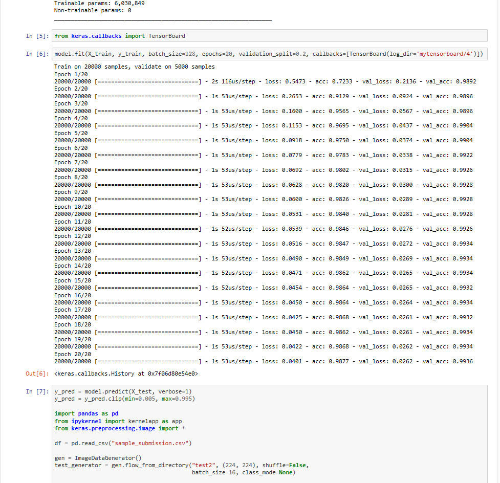

## Dogs vs. Cats Project Preprocess
本项目需要安装cuda9.0,与cudnn。在ubuntu 16.04系统下训练，
将pip更新至10.0.0版本后，使用 *pip install -r requirements.txt* 进行安装。
从kaggle下载到训练集与测试集后，解压到该目录，目录名分别为 *train* *test*。
## Train
#### 本项目有两种训练方案，第一种为：
注意：该训练方案，主机内存必须大于60G，否则训练会因内存耗尽失败。
首先在该目录下使用linux16.04的terminal运行 *python preprocess.py* ,
之后使用jupyternotebook打开resnet.ipynb,直接训练即可。
#### 第二种训练方案：
使用 jupyter notebook 打开combine.ipynb，直接训练即可，最終的测试集loss为0.03722.
训练成功截图如下：

